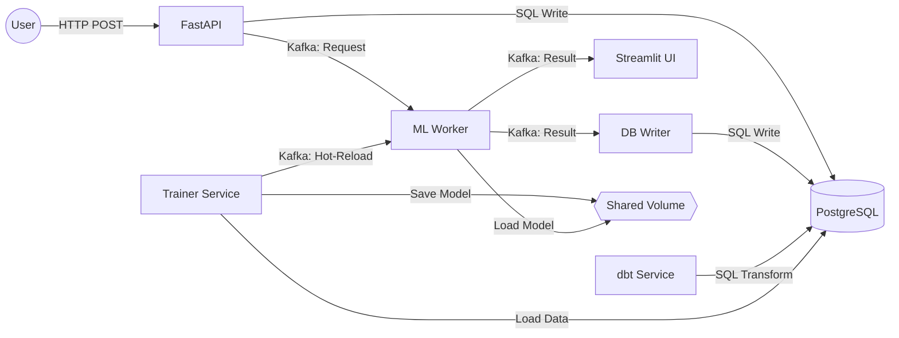

# One-Pager: SasRec Recommendation Service

## Обзор проекта
Сервис для персонализированных рекомендаций на основе архитектуры SasRec. Система позволяет предсказывать следующий товар, который заинтересует пользователя, на основе истории его действий. Реализован асинхронный инференс через Kafka, хранение интеракций и результаты в Postgres, хот-релоад весов без даунтайма, готовые дашборды мониторинга и витрины аналитики.

## Ключевые особенности
- **ML Модель**: SasRec (PyTorch), чекпоинты + конфиг + словарь в `checkpoints/`.
- **Асинхронный Инференс**: Использование Kafka для decoupling сервисов API и ML-воркера.
- **UI**: Интерфейс для имитации запросов и отображения результатов в реальном времени, слушая события из Kafka.
- **Мониторинг**: Дашборды Grafana для отслеживания работы системы, метрик производительности и дрифта данных.
- **Аналитика (ETL)**: Встроенный dbt пайплайн для автоматического расчета бизнес-метрик, витрина `dm_daily_stats` (DAU, число предсказаний), автозапуск каждый час.
- **Переобучение**: Автоматизированный пайплайн переобучения на данных из Postgres и механизм Hot-Reload для обновления модели без простоя.
- **Воспроизводимость**: Полная контейнеризация с Docker Compose.

## Стек
- **ML Core**: PyTorch
- **Backend**: FastAPI
- **Message Broker**: Apache Kafka
- **Database**: PostgreSQL
- **ETL/Analytics**: dbt
- **Frontend**: Streamlit
- **Observability**: Prometheus, Grafana
- **Infrastructure**: Docker, Docker Compose

## Бизнес-ценность
Хорошие рекомендации напрямую влияют на удержание пользователей, предоставляя высокорелевантный контент. Использование последовательных паттернов поведения позволяет лучше понимать динамические интересы пользователей по сравнению со статическими методами, что ведет к:
- **Росту CTR (Click-Through Rate)**
- **Увеличению длительности сессии**
- **Повышению удовлетворенности пользователей**

## Архитектура

